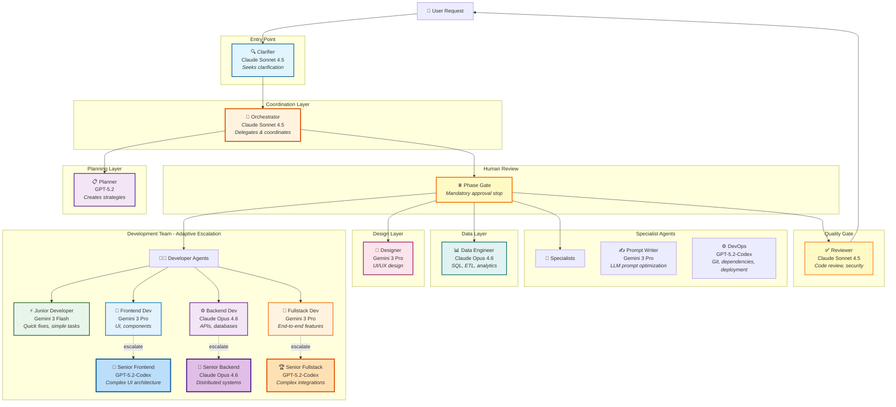

# GHCPAgentPipeline

A production-grade orchestrated agent system for GitHub Copilot that breaks down complex development tasks into specialized workflows with adaptive escalation, quality gates, and requirement clarification.

> **Forked from [simkeyur/vscode-agents](https://github.com/simkeyur/vscode-agents)**

> 💡 **Tip:** Start with the **Orchestrator** agent — it will automatically delegate to the right specialists!

## Changes from upstream

- **Phase Gate** — The Orchestrator now includes a mandatory human review stop (`⏸️ PHASE GATE`) between planning and execution. After the Planner produces a plan and execution phases are parsed, the Orchestrator presents both in full and waits for explicit approval before any implementation begins. Feedback loops back through the Planner; approval proceeds directly to execution with no additional confirmation.
- **Planner saves plan to disk** — The Planner writes its output to `output/plans/{short-description}-plan.md` and returns explicit per-step file assignments required for phase parsing and the gate review.
- **Sub-agents prefixed `[Orch]`** — All sub-agents are named `[Orch] <Role>` (e.g. `[Orch] Clarifier`) to make clear they are invoked via the Orchestrator, not directly by the user.
- **Restricted Orchestrator tools** — The Orchestrator's tool set is trimmed to `['read', 'agent', 'vscode/memory']`. It coordinates only; it does not implement.
- **Removed unavailable tools** — `context7/*` and `github/*` removed from all agent tool lists. `memory` corrected to `vscode/memory` everywhere.
- **Removed context7 body instructions** — Inline references to `#context7 MCP Server` removed from all agent bodies; replaced with `#fetch` / web search equivalents where applicable.
- **Agent files at `.github/agents/`** — Canonical path for VS Code Copilot agent discovery.

---

## Agent Architecture



---

## Agent Roster

| Agent | Model | Primary Role |
|-------|-------|--------------|
| **[🔍 Clarifier](.github/agents/clarifier.agent.md)** | Claude Sonnet 4.5 | Requirements Analysis |
| **[🎯 Orchestrator](.github/agents/orchestrator.agent.md)** | Claude Sonnet 4.5 | Coordination |
| **[📋 Planner](.github/agents/planner.agent.md)** | GPT-5.2 | Strategy |
| **[⚡ Junior Developer](.github/agents/junior-dev.agent.md)** | Gemini 3 Flash | Quick Fixes |
| **[🎨 Frontend Developer](.github/agents/frontend-dev.agent.md)** | Gemini 3 Pro | Component Implementation |
| **[⚙️ Backend Developer](.github/agents/backend-dev.agent.md)** | Claude Opus 4.6 | API Logic & CRUD |
| **[🔄 Fullstack Developer](.github/agents/fullstack-dev.agent.md)** | Gemini 3 Pro | End-to-End Features |
| **[🚀 Senior Frontend Developer](.github/agents/sr-frontend-dev.agent.md)** | GPT-5.2-Codex | Complex UI Architecture |
| **[💎 Senior Backend Developer](.github/agents/sr-backend-dev.agent.md)** | Claude Opus 4.6 | Distributed Systems |
| **[🏆 Senior Fullstack Developer](.github/agents/sr-fullstack-dev.agent.md)** | GPT-5.2-Codex | Complex Integrations |
| **[📊 Data Engineer](.github/agents/data-engineer.agent.md)** | Claude Opus 4.6 | Analytics & Data Pipelines |
| **[🎨 Designer](.github/agents/designer.agent.md)** | Gemini 3 Pro | Visual Design & Mockups |
| **[✍️ Prompt Writer](.github/agents/prompt-writer.agent.md)** | Gemini 3 Pro | Prompt Engineering |
| **[⚙️ DevOps](.github/agents/devops.agent.md)** | GPT-5.2-Codex | Operations |
| **[✅ Reviewer](.github/agents/reviewer.agent.md)** | Claude Sonnet 4.5 | Quality Assurance |

---

## Orchestrator Execution Flow

```
Step 0: Clarify Requirements
Step 1: Get the Plan  ← Planner saves plan to output/plans/, returns file assignments
Step 2: Parse Into Phases  ← Determine parallel vs sequential tasks
Step 3: ⏸️ PHASE GATE  ← Present plan + phases, wait for human approval
Step 4: Execute Each Phase  ← Parallel where possible, adaptive escalation
Step 5: Review  ← Reviewer checks for bugs, security, quality
Step 6: Report Results
```
